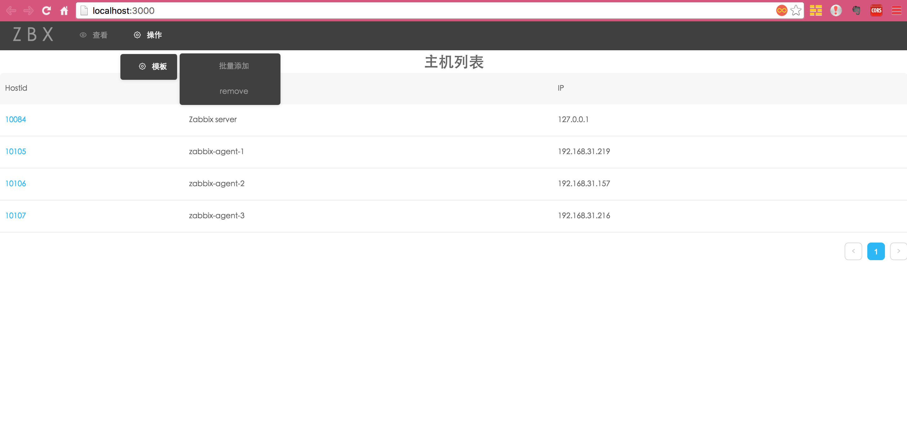

##ZBX,一个简易的zabbix管理系统的前端部分，后端请戳[zbx-backend](https://github.com/yangtingting02/zbx-backend)。

###运行
- 获取代码
```
git clone git@github.com:yangtingting02/zbx-app.git
```
- 安装`create-react-app`
```
npm install -g create-react-app
```
- 安装module
```
npm install
```
- 运行
```
npm start
```
- 访问
```
open localhost:3000
```

###依赖
这是简易zabbix管理系统前端部分,使用react技术栈构建的SPA:
- [react](https://facebook.github.io/react/)
- [react-router](https://github.com/ReactTraining/react-router)
- [antd](https://ant.design/)
- [echarts-for-react](https://github.com/hustcc/echarts-for-react)
- [jquery](http://jquery.com/)

###功能展示
- 主页

- ITEM列表

- 主机详情


- 监控曲线图

- 批量添加模板

- '友好的提示'...

